# Random-Password-Generator

## Description

The objective of this project was to create an application which could be used by an employee to generate a random password. 

The application was required to give allowance for the user to specify their password preferences, based on:

- Password length, and

- Character types: Lowercase, Uppercase, Numeric and Special Characters.

It is imperative that the user specifies how many characters they want in their password. This can be between 10 and 64 characters inclusive. The user can then choose to include at least one character type.

The application must include prompts to streamline the user experience and validate user responses. Once the prompts are responded to, it should then generate a password which is displayed to the user.

The project was carried out using JavaScript code, and was created to run in the browser. It is also responsive and adapts to multiple screen sizes.

## Installation

The application, linked below, was deployed using GitHub Pages. 

Simply upload the index.html and license.txt files, along with the assets folder which contains the script.js, style.css and image files, to the desired webserver.

## Usage

[Link to the deployed Random Password Genrator application on GitHub Pages](https://ccmong.github.io/Random-Password-Generator/)

[Link to the GitHub code repository](https://github.com/CcMong/Random-Password-Generator)

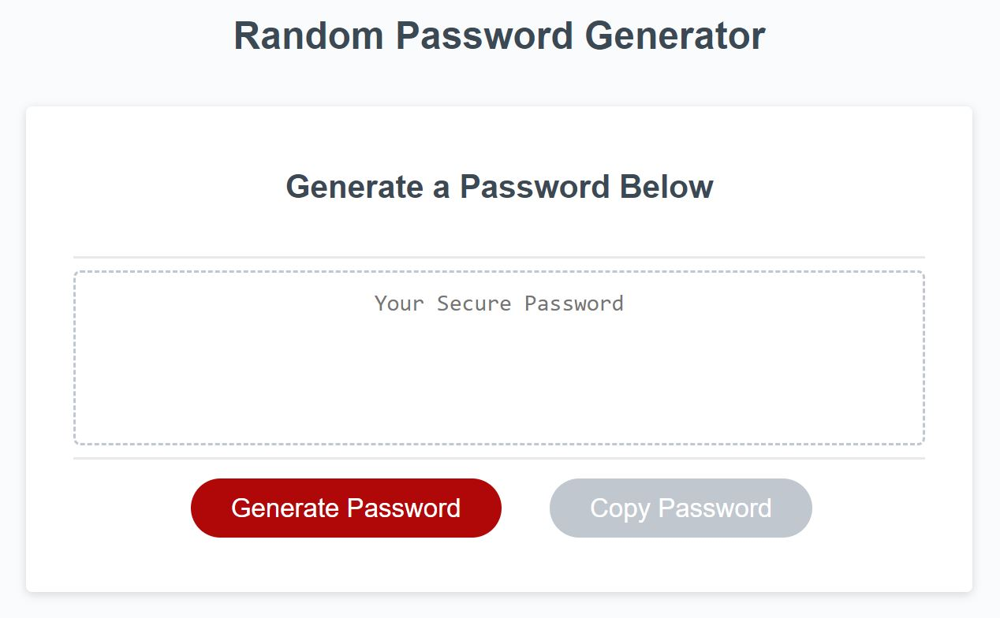

The user starts by clicking the "Generate Password", and they are prompted to specify a number between 10 and 64 inclusive. The "Copy Password" button is disabled until a password has been generated and is available to be copied.  

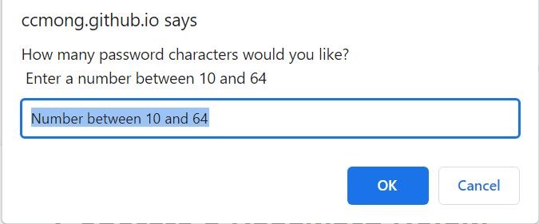

The user can click "Cancel" to exit the prompt, or type in a number. An error message is shown either if the user inputs text, inputs a number outside the 10-64 range, or attempts to proceed without any input.

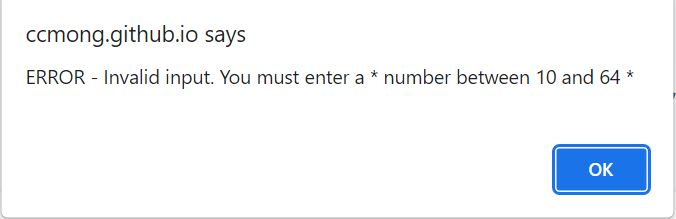

When the user has inputted a valid character length entry, they are taken through the different character types:

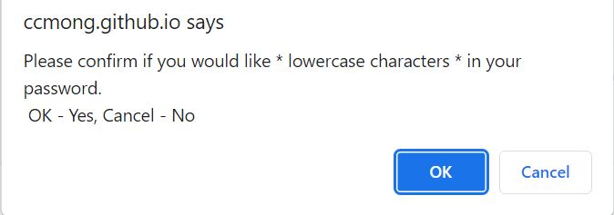

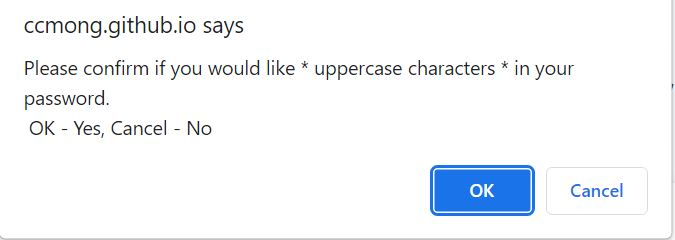

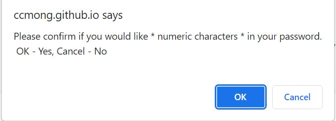

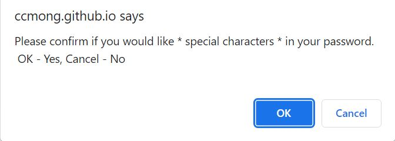

If the user does not choose at least one of the character options, an error message is displayed. Then the user is taken back through all the options again.

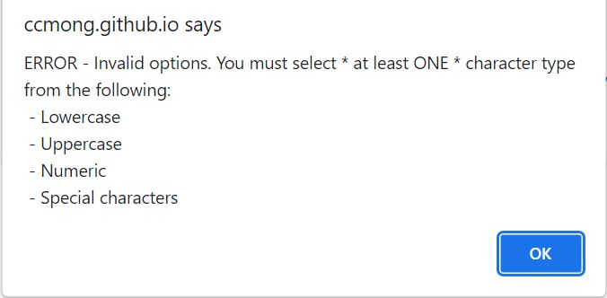

Once the user's character options are valid, an alert is displayed informing the user that the password has been generated. 

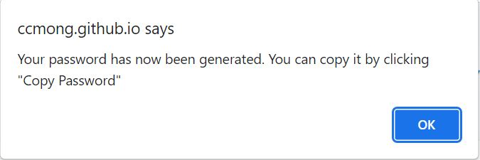

When acknowledged, the password is displayed in the the text area and the "Copy Password" button becomes enabled.

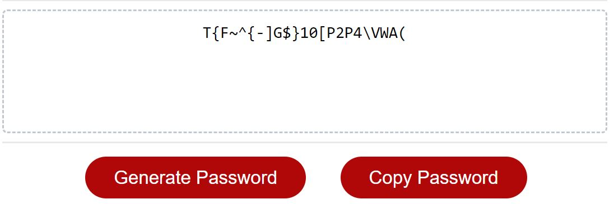

The user can click it to copy the password, and it will be copied to the clipboard.

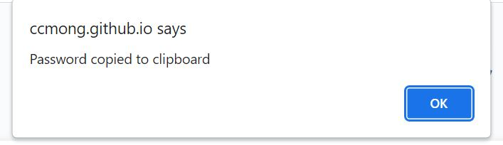

## Credits

[MDN Web Docs](https://developer.mozilla.org/en-US/), for general reference

## License

MIT License.

Please refer to the LICENSE in the repo.

## Badges

